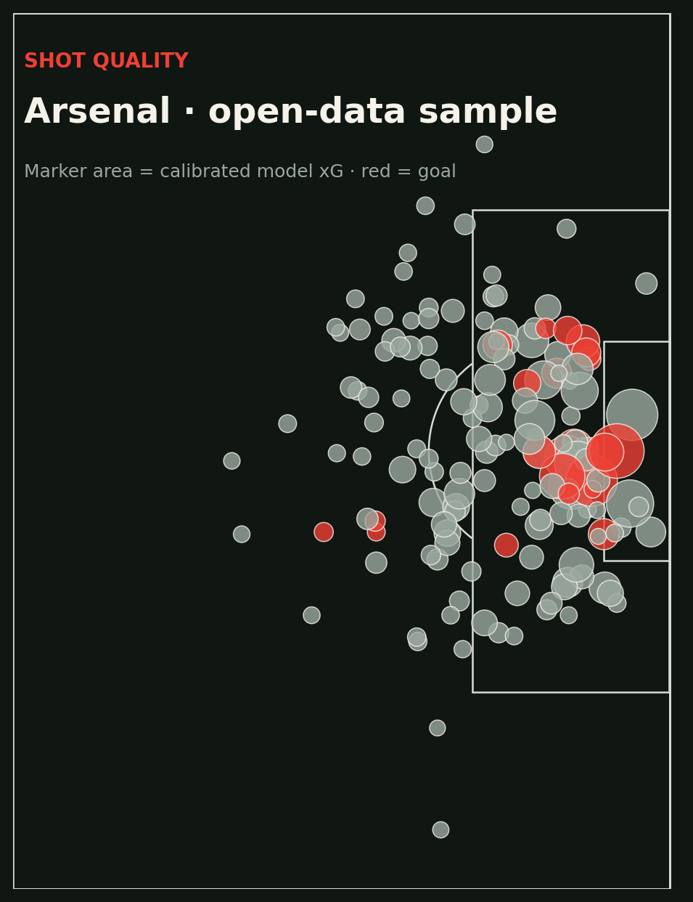

# Invincibles xG

An explainable expected-goals research pipeline built around one analyst question: **which shot characteristics changed chance quality, and can we communicate that without hiding model uncertainty?**



This is intentionally more than a shot-map notebook. It parses provider JSON into a stable feature table, keeps matches intact during cross-validation, reports calibration as well as ranking, and produces a presentation-ready visual.

## What it demonstrates

- Reusable Python package and CLI
- Football-specific feature engineering
- Leakage-resistant grouped validation
- Calibration, discrimination, and a written model card
- A restrained visual designed for a coaching/analysis conversation

## Run

```bash
python -m venv .venv
source .venv/bin/activate
pip install -e ".[dev]"
python scripts/download_open_data.py
invincibles-xg data/raw/events --output artifacts
pytest
```

Outputs are `shot_predictions.csv`, `metrics.json`, and `shot_map.png`.

## Data

The downloader retrieves a compact set of Arsenal men (2003/04) and Arsenal Women (2023/24) matches from [StatsBomb Open Data](https://github.com/statsbomb/open-data). If you publish analysis based on this project, credit StatsBomb and follow the terms in its repository.

Raw events are ignored by git. The small table in `data/sample` contains derived features for the demo only.

## Research decisions

I chose logistic regression because an analyst can challenge the direction and magnitude of every feature. With a small open sample, a more expressive model would add variance faster than it adds useful signal. The next production step would be calibrated gradient boosting and a held-out-season comparison, not a reflexive jump to deep learning.

See [`MODEL_CARD.md`](./MODEL_CARD.md) for intended use and limitations.
